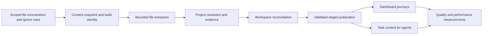

# GoreGraph improvement design

Status: proposed implementation design; no runtime changes are included.
Date: 2026-09-09. Baseline checkout and installed release: `081b405`, GoreGraph 1.4.0, output schema 3.

## Purpose and priorities

Improve GoreGraph as a dependable local code-intelligence tool for people and coding agents. Dashboard and agent support have equal product priority. For agents, success specifically means reaching a correct solution sooner with fewer end-to-end tokens, including subsequent searches, retries, tests, and corrections.

The sequence below expresses engineering dependencies, not lower priority for either consumer. Deliver incremental, separately reviewable MRs. Do not start with a rewrite, a database migration, or additional language support.

## Evidence and uncertainty

| Observation from the review | Interpretation |
|---|---|
| Existing WEKA index: 43 projects, 295 provider endpoints, 250 resolved, 8 ambiguous and 112 unresolved contract matches | Useful existing coverage; these classifications have not been independently verified one by one. |
| Last existing workspace generation: 2026-08-27 | Snapshot age is known; current semantic completeness is not. |
| Git ignores `apps/wekapilot/dist-offline/` through `dist-offline/`; GoreGraph includes three JS bundles there | Confirmed directory-ignore defect in `internal/gitignore/gitignore.go`. |
| Root `.gitignore` is the only ignore file loaded | Nested repository ignore rules are not represented. |
| One approximately 60 KB TSX source took approximately 3.2 seconds for symbol extraction; one 439 KB bundle exceeded a 15-second measurement limit | Local diagnostic measurements, not controlled performance benchmarks. |
| A 35-second scan sample was in `scriptShadowReason` during script symbol extraction | Repeated lexical work is confirmed; an infinite loop was not established. |
| Progress repeats elapsed time without phase or file information | User cannot distinguish productive work from a stalled phase. |
| Update selection checks source hashes and schema, not analyzer identity | Same-schema analyzer changes can leave old analysis selected as current. |
| Writers replace existing artifacts while building a new output | Recovery and reader consistency need explicit contracts. This is a design risk, not an observed loss of user source. |
| Scanner/config/ignore tests passed; agent/CLI tests failed in the review sandbox | Reproduce and classify path/permission/Git ownership effects before labeling product regressions. |
| Workspace symbol usages occupy approximately 138 MB; context index approximately 18 MB | Measure load and memory costs before choosing storage changes. Dashboard already has usage-asset sharding. |

Private WEKA source, prompts, logs, paths containing business details, and generated indexes stay outside committed fixtures and published benchmark artifacts. Synthetic fixtures must reproduce structural behavior without copying proprietary bodies.

## Approach decision

1. **Recommended: improve the existing pipeline in stages.** Correct selection, instrument and bound analysis, optimize lexical work, make publication recoverable, then improve both consumers and measure task outcomes. Preserves the current strengths and isolates regressions.
2. **Only patch ignores and progress.** Useful emergency delivery, but insufficient for analyzer scaling, stale results, and agent effectiveness. This is the first delivery slice, not the full program.
3. **Replace the analyzers/storage/UI together.** Potential long-term benefits but no current evidence justifies the compatibility and validation cost. Reconsider a specific replacement only if the measured gates below remain unmet.

## Global constraints

- Preserve the Go 1.23 language floor unless a separately justified compatibility decision changes it.
- Preserve Windows, Linux, and macOS support; the repository already tests all three in CI.
- Keep scans local, deterministic, offline, and free of execution of scanned project code.
- Do not add a runtime dependency without a documented gap that cannot reasonably be handled by the existing implementation or standard library.
- Preserve conservative evidence: unresolved is not absent, missing authentication evidence is not public access, and static reachability is not runtime execution.
- Keep source confidentiality, path confinement, configuration-value redaction, and bounded agent payloads intact.
- Keep existing CLI aliases and agent/dashboard/all targets working; document additive fields and any deliberate protocol change.
- Separate output structural integrity, analysis coverage, and freshness. A usable output can have explicitly partial analysis; it must never silently claim full coverage.
- Do not modify agent configuration, Git configuration, or user source automatically.
- Use English code comments, commit messages, MR titles and descriptions; follow the existing formatting and test style.
- Keep private WEKA data outside committed fixtures and public CI.
- Do not publish a release, replace the installed binary, or rebuild user indexes during plan execution until the implementation has passed its delivery gate and that operational step is authorized.

## Target architecture

### 1. One file-selection contract

Use one enumerator for scans, update snapshots and source freshness checks. Preserve include/exclude behavior, size limits and symlink policy. Apply directory-scoped `.gitignore` rules with original anchoring, basename matching, negation precedence, `**`, escaped comment/negation prefixes, and Git's excluded-parent rule. Child ignore rules cannot resurrect children of a pruned parent. Do not consume machine-global Git excludes: scan results must be reproducible across machines.

Use `git check-ignore --no-index` only as a test oracle in temporary owned repositories, with isolated Git configuration. Runtime scans do not acquire a Git subprocess dependency. Record skip reasons and the effective ignore-rule digest. Cancellation, unreadable directories, and file changes during enumeration are explicit outcomes rather than apparent successful deletion.

### 2. Bounded, observable analysis

Propagate `context.Context` and one event contract through enumeration, extraction, resolution, projection and publication. Keep existing exported entry points as wrappers. Human progress is throttled to at most one line per second; active work emits a heartbeat at least every five seconds. Events contain phase, project, relative file, completed units, known total, elapsed time and outcome. Never invent a percentage while the total is unknown.

JSON command results remain valid JSON; progress goes to stderr. Add `--progress auto|plain|json|off`, `--file-timeout` and `--project-timeout` to build and workspace build/update, consistently across compatibility aliases. Proposed defaults: file analysis budget 5 seconds, project budget disabled (0). Ctrl+C cancels the shared context and returns exit 130; file budget exhaustion records a partial-analysis diagnostic; project cancellation/deadline never publishes a new project result. Checks inside lexical loops are required; abandoning a goroutine is not cancellation.

Build one lexical index per JS/TS file: masked text, line offsets, matching delimiters, scope boundaries, declarations and bindings. Resolve usage ownership and shadowing from this index. Preserve the existing conservative resolver and facts unless an explicit correctness test justifies a change. Do not make all `*.min.js` files disappear silently: honor ignore rules, report generated/minified classification, and let resource budgets produce explicit partial coverage for included files.

### 3. Correct update identity and reuse

Add independent extractor, resolver, agent-projector and dashboard-projector revisions. Store a normalized configuration digest, analysis-policy digest (including the per-file budget), ignore digest, source-content fingerprint, and build version/commit for diagnostics. Revision changes, not documentation-only release changes, invalidate analysis. Missing identity in schema-3 output triggers a one-time rebuild when updating. Raising a file budget invalidates prior partial extraction; an explicit build can retry the same policy. An unchanged update must not repeatedly retry a known partial file without an input or policy change.

An update that changes no inputs, revisions or requested projection must perform no extraction or reconciliation and must preserve output bytes and generation timestamps. Source changes, removed projects, layout-configuration changes and projection revision changes invalidate the appropriate layers. Recheck selected inputs before publication; a source edit during the build yields an explicit changed-input failure, never a current-looking mixed snapshot.

After correctness and profiling, cache only pure file-level script extraction facts, keyed by relative path, content hash and extractor revision. Resolve imports and cross-project relationships again when relevant inputs change. Corrupt caches are disposable misses. No mtime-only correctness decision and no persistent raw source-body cache. Broader caching or project parallelism requires evidence that this slice is insufficient.

### 4. Recoverable publication

Stage the new output on the same filesystem, validate it, acquire a per-output writer lock, and publish with a persisted recovery journal and retained last-good backup. A failure before commit restores the prior complete generation; recovery is idempotent. Commit metadata records generation identity and per-projection input identity, including projections intentionally left stale by an agent-only or dashboard-only update.

This is a recoverable multi-file transaction, not a claim that Windows can atomically replace an entire populated directory tree. Built-in readers use a common output-read boundary: they either read a stable committed generation or return a precise build-in-progress/recovery-required error. They never decode a mixture and call it current. OS locks release on process death; no permanent lock based only on an orphaned file.

Static dashboards use generation-qualified immutable lazy assets and publish the HTML last. Retain the previous complete dashboard asset generation during normal cleanup so an already open dashboard remains usable across the next rebuild. Index transactions also cover workspace overlays written into project output directories. Acquire multiple output locks in canonical absolute-path order; revalidate inputs after locking; never hold project locks while waiting for a differently ordered workspace lock.

Keep the current public output layout in the first implementation. Add journal and identity metadata without silently changing file paths. Old external readers cannot obtain new transactional guarantees: document the limitation. If a compatible journal-based implementation cannot satisfy the Windows failure-injection tests, stop that task and write an explicit generation-layout migration decision before changing paths or schema.

### 5. Evidence, freshness and human workflows

Every main view must distinguish last successful generation, current/stale/unknown source status, structural health, analyzer support, and partial coverage. Preserve route ambiguity with inspectable candidates and evidence. Diagnose why a match failed and offer concrete next actions; do not optimize the resolved percentage by suppressing hard cases.

Improve existing views around three end-to-end journeys:

1. Consumer call -> provider route -> implementation -> source evidence.
2. Selected symbol/endpoint -> bounded impact -> uncertainty and affected projects.
3. Changed behavior -> relevant existing tests -> static verification suggestions.

Reuse Architecture, API Catalog, Endpoints, Code Explorer, Diagnostics and Coverage. Improve cross-navigation, back navigation, search, empty/error states and source links before creating any new view. Verify keyboard navigation, visible focus, 200% zoom, and offline asset loading. Show actionable analysis information rather than internal implementation machinery.

### 6. Useful context for coding agents

Retain the default single `task_context` MCP tool and bounded CLI pack. Measure and remove irrelevant metadata before enlarging budgets. Preserve the default 4,000-token and 12-file limits. Separate current verified source from indexed claims and from unknown decisions.

Version the interaction protocol. Preserve the existing strict instruction as `strict-v1` for historical replay. Introduce `adaptive-v2` as the candidate normal workflow: use supplied source directly; perform a bounded follow-up only for an explicit omitted concern, stale evidence or contradiction; stop repeating ineffective context requests; then fall back to the caller's normal repository workflow under the caller's own permissions. A pack is evidence, never an authority that forbids the user or agent from verifying a required behavior.

The tool itself never widens filesystem scope, runs project code, or exposes secrets. Suggested checks contain exact safe existing paths/ranges and a reason; missing or unsafe paths remain uncertainty. Keep the existing one anchored retry allowance. `source_coverage: complete` describes the represented required concerns, not proof that the entire repository contains nothing else relevant. No training of rules on reserved evaluation answers or private vocabulary.

### 7. Quality and outcome gates

Create a frozen, disjoint evaluation matrix spanning Java/Spring, TypeScript/React and cross-project flows. Include successful changes, missing contracts, conflicting candidates, stale inputs, ignored bundles, unsupported syntax and insufficient evidence. Include equivalent German and English task formulations without translating user intent inside production code.

Evaluate people and agents independently. Agent end-to-end runs must attempt the task through implementation and meaningful verification where that task calls for a change. Count unsuccessful runs, fallbacks and correction work. Freeze model, reasoning, permissions, source snapshot, prompt, tool access and pricing inputs when calculating costs. Do not replay a new protocol and present its score as the historical strict-v1 result. Report pre-indexed task latency and cold-start latency including index construction separately, and state the number of tasks needed to amortize setup/update cost. Do not hide indexing cost when claiming faster completion.

| Gate | Acceptance target |
|---|---|
| Ignore correctness | All synthetic Git-parity cases pass; zero ignored bundle files in the selected real frontend run. |
| Existing functionality | Entire supported CI matrix green; no blanket skips for the review's failures. |
| Cancellation | Cooperative work stops within 1 second of cancellation on the controlled stress fixture; no worker keeps consuming CPU after command completion. |
| Publication | Failure at every staged/publication boundary preserves or restores a valid last-good generation; no mixed output read by built-in clients. |
| Update correctness | Unchanged update performs zero extraction/reconciliation; config/revision/ignore/rename/delete changes invalidate correctly. |
| Analysis quality | No new false exact/resolved claims in labeled adversarial cases; reviewed true-edge coverage does not decline to obtain speed. |
| Script performance | Controlled 2x-size regular-source fixtures take at most 3x time across five-run medians; target at least 4x speedup on the selected slow-source case without reducing facts. |
| Update performance | Target at least 50% lower five-run median time for a one-file change in the fixed frontend fixture after safe extraction reuse. |
| Human use | Each of the three defined journeys reaches the expected evidence and tests without a broken link, dead end or loss of selection context. |
| Agent quality | Correct-task completion rate does not decline; no new critical incorrect edits; blinded rubric quality is at least baseline. |
| Agent efficiency | Target at least 25% lower median end-to-end uncached-input-plus-output tokens and at least 20% lower median time to verified completion; disclose sample size and per-case regressions. |

Performance numbers are proposed gates, not achievements or promises about arbitrary repositories. Freeze hardware and workloads in baseline task A0. Any adjustment requires an explicit rationale before evaluating the final candidate, never after seeing inconvenient results. Keep the existing release benchmark gates in force unless a separately versioned contract explicitly replaces them. New gates add evidence rather than weakening old criteria.

## Delivery plan and dependencies

| Slice | Plan | Primary outcomes | Dependencies |
|---|---|---|---|
| A | [Scan reliability and performance](../plans/2026-09-09-scan-reliability.md) | Reproducible baseline, correct ignores, progress/cancellation, lexical scaling, correct update identity | Existing checkout |
| B | [Output trust and dashboard usefulness](../plans/2026-09-09-output-trust.md) | Recoverable outputs, freshness, safe reuse, measured load costs, three human journeys | A identity/event contracts; A0 for measurements |
| C | [Agent effectiveness and release validation](../plans/2026-09-09-agent-effectiveness.md) | Versioned adaptive workflow, bounded relevant context, task-level evaluation, complete release gate | A0 first; final agent evaluation after A/B |

Evaluation fixture design and human journey specifications can begin immediately after A0. Integrate shared scan and serialization changes sequentially. Do not combine all slices into one unreviewable MR. Each task in the linked plans ends with narrow validation, documentation of behavior changes and an English imperative commit when implementation is authorized.

## Release and operational acceptance

1. Reproduce the review failures in the normal supported Windows environment and isolated CI; separate permission/ownership failures from product behavior with retained exact errors.
2. Complete targeted task gates, then run existing full CI, vet, documentation synchronization and established regression/release evidence workflows.
3. Build a candidate binary alongside the installed release. Validate on synthetic fixtures and an isolated permitted WEKA snapshot. Do not update business repositories as part of a scan.
4. Check real ignored-bundle exclusion, cold scan, unchanged update, single-file change, cancellation, recovered output and representative dashboard/agent journeys.
5. Preserve last-good outputs and document the one-time identity rebuild. If file format changes become necessary, provide explicit migration and rollback instructions before release.
6. Release/install/rebuild production indexes only after the above outcomes are available for review and the operational action is authorized.

## Non-goals and stopping rules

No new language families, hosted service, telemetry, embedding service, automatic Git updates, UI framework rewrite, database migration or uncontrolled scan parallelism is included. A new dependency, schema migration, parser replacement or broader cache is a measured design decision, not an implicit implementation shortcut.

If semantic fidelity falls, stop the optimization and retain the existing analyzer path. If agent token use falls but completion quality worsens, the protocol does not pass. If the dashboard is usable but the agent gate fails, do not market an agent-efficiency improvement. Equal priority means both consumers have release evidence, not that every MR must modify both.
